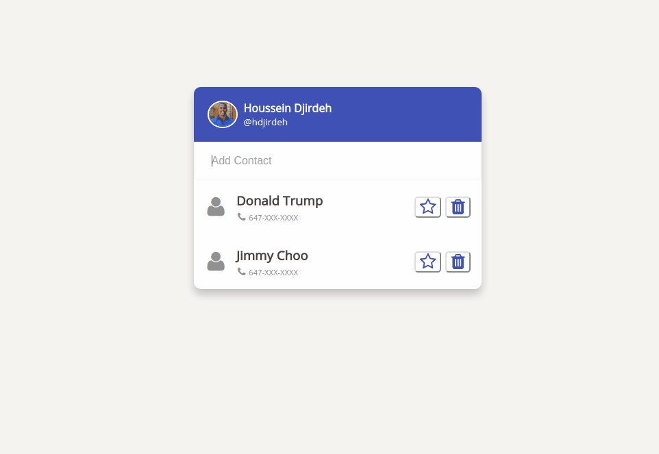

# Angular 2 and Redux Tutorial: Contact List

:clipboard: A simple contact list application built with Angular 2, Immutable.js and Redux.

[Link to demo](https://embed.plnkr.co/ns1tfi/)

  

## The breakdown

This is the source code for my [blog post](http://houssein.me/redux/immutablejs/angular2/2016/07/02/angular2-with-immutablejs-and-redux.html) where I explain how I build this application step by step:

 + The basic setup with a single component
 + Multiple components with properties
 + Implementing OnPush change detection strategy
 + Ensuring immutability with [Immutable.js](https://facebook.github.io/immutable-js/)
 + Creating a [Redux](http://redux.js.org/) state container

## Getting Started

 - Clone or download the repo
 - Run `npm install`
 - Run `npm start`

This will run the server and launch the browser with the application.